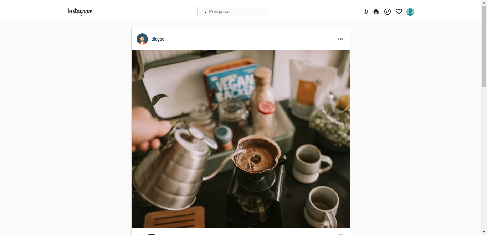
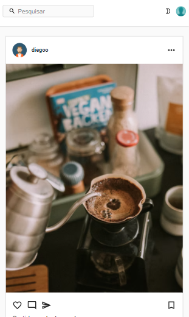
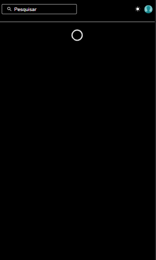

<div id="top"></div>

<br />

<div align="center">

<a href="https://github.com/alexdiegoo/instagram-clone">


</a>

<h3 align="center">Instagram Clone</h3>

<p align="center">

Clone do feed do instagram

<br />

<a href="https://61969f40a7e44272000207eb--fervent-gates-fb342b.netlify.app/"><strong>Demonstração »</strong></a>

<br />

</p>

</div>

<details>

<summary>Índice</summary>

<ol>

<li>

<a href="#about-the-project">Sobre o projeto</a>

<ul>

<li><a href="#built-with">Tecnologias usadas</a></li>

</ul>

</li>

<li>

<a href="#getting-started">Como testar o projeto localmente</a>

<ul>

<li><a href="#prerequisites">Pré-requisitos</a></li>

<li><a href="#installation">Instalação</a></li>

</ul>

</li>
</ol>

</details>

<div id="about-the-project"></div>

##  Sobre o projeto

<p align="center">

<br />

<br />


</p>

Esse projeto foi desenvolvido com o objetivo de melhorar minhas habilidades em React e também aprender novas tecnologias como o styled-components.

O projeto conta com funcionalidades de: 
* Carregamento de conteúdo a medida que o usuário faz rolagem na página.
* Troca de temas entre o modo escuro e o modo claro (padrão).
* Exibir comentários das postagens.
* Consumir os dados de uma api fake feita com o json-server.

<div id="built-with"></div>

###  Tecnologias usadas

O projeto foi desenvolvido com as seguintes tecnologias:

* [React.js](https://reactjs.org/)
* [Styled-components](https://styled-components.com/)
* [Material UI - Icons](https://v4.mui.com/pt/components/icons/)
* [Json-server](https://www.npmjs.com/package/json-server)

<div id="getting-started"></div>

##  Como testar o projeto localmente

<div id="prerequisites"></div>

###  Pré-requisitos

Para rodar o projeto localmente você precisa ter o [Node](https://nodejs.org/en/) instalado.

<div id="installation"></div>

###  Instalação

_Após instalar o node, siga as etapas:_

1. Clonar este repositório

```sh

git clone https://github.com/alexdiegoo/instagram-clone.git

```

3. Entre na pasta api e instale os pacotes NPM

```sh

npm install

```

4. Inicie a API com o comando ainda na pasta api/

```sh

npm start

```

5. Agora na pasta web instale os pacotes NPM e inicie o front-end com `npm start`
```sh

npm install

```
```sh

npm start

```

<p align="right">(<a href="#top">Voltar para o início</a>)</p>

## 🔎 Onde me encontrar

* [Instagram](https://www.instagram.com/alex.diego10/)
* [Linkedin](https://www.linkedin.com/in/alex-diego/)

